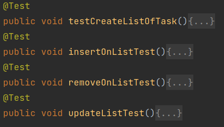
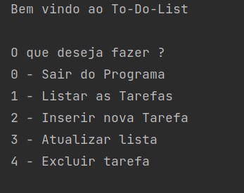

# To-Do-List

# Próximos Updates:

- Opção de desfazer alterações.
- Data (tipo)
- Editar Tarefas.
- Entradas Inválidas não são permitidas em toda a execução do código.

# Versão 1.0.1-alpha

**-Organização de classes.**

**-Implementação de testes unitários em funções de inserir, excluir e exportar dados.**

**-Refatorei o código e desacoplei funções (Ficou melhor de entender 🙂).**

**-Correção de Bugs 😵:**

*Se você inserisse uma prioridade menor que um e maior que cinco, o programa rodava normalmente, contudo, não era pra rodar...*

## Testes Unitários:

- Testes de Criação da lista de tasks.
- Inserção de um elemento na lista.
- Remoção de um elemento na lista
- Atualizando o banco de dados da lista.

Nestes testes usei de dependências o JUnit e o Mockito.

Por conta dos testes, tive que refatorar as funções e organizar melhor o código. Assim, consegui implementar os testes com mais eficiência.
# Versão 1.0.0-alpha

**-Implementação da Aplicação.**

## Funções:

### Listar as Tarefas:

- Por Categoria;
- Por Prioridade;

Aqui, você receberá um output com uma listagem seccionada por cada ramo de categoria ou prioridade único dentro da sua lista. 

### Inserir as Tarefas:

Você poderá inserir uma tarefa com as seguintes características:

- Nome
- Descrição
- Prioridade
- Data de Termino
- Categoria
- Status

Ela insere dentro da lista de tarefas, mas ainda não atualiza automaticamente o arquivo. 

Não alterará o arquivo, será necessário ou atualizar a lista ou sair da aplicação pelo menu. Isso irá aplicar as alterações.

<aside>
💡 Nota: Não é possível deixar alguma características vazia.

</aside>

### Atualizar a lista

Aqui ela exporta suas alterações para o arquivo salvo.

### Excluindo uma Tarefa:

Aqui você irá receber a lista de tarefas e dizer o índice da tarefa que você deseja excluir. 

Não alterará o arquivo, será necessário ou atualizar a lista ou sair da aplicação pelo menu. Isso irá aplicar as alterações.

### Saindo do Programa:

Aqui você irá sair do programa e terá suas alterações salvas dentro do programa.
